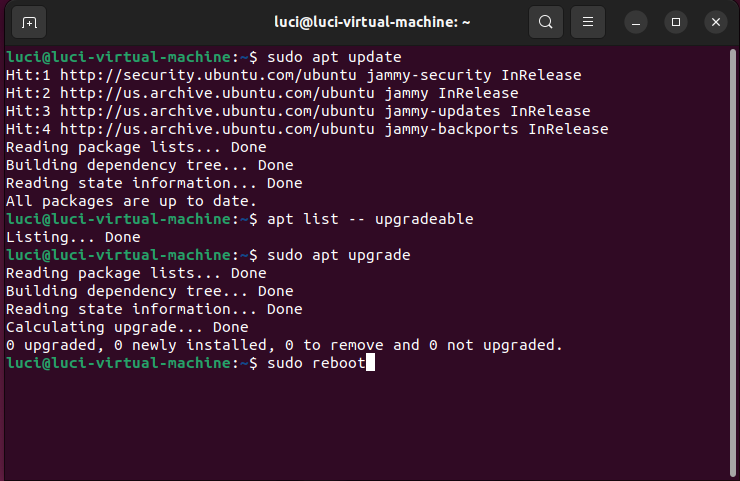
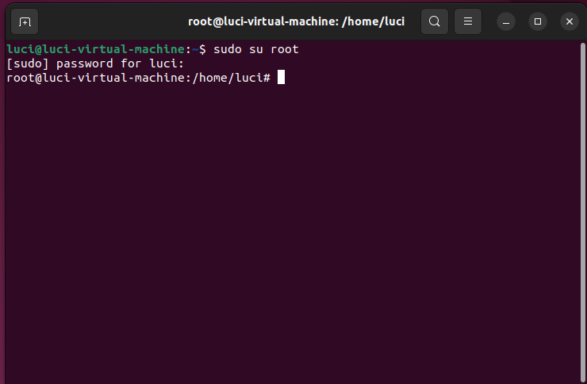
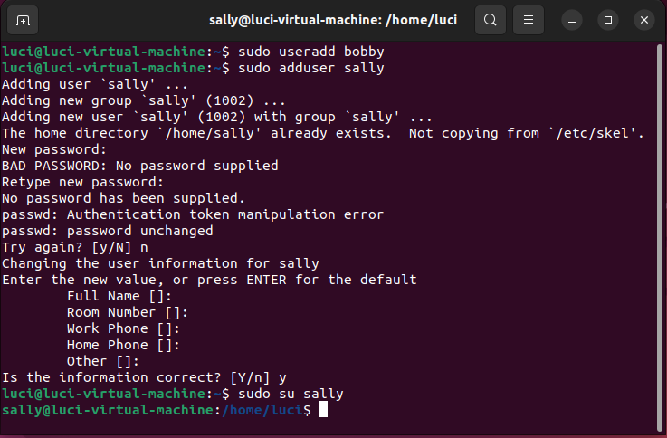
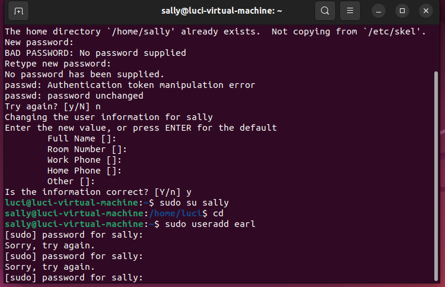
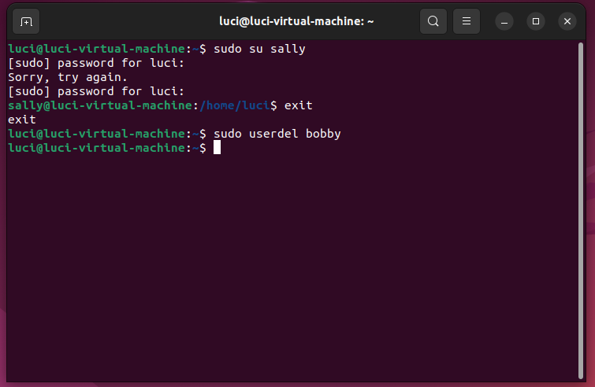
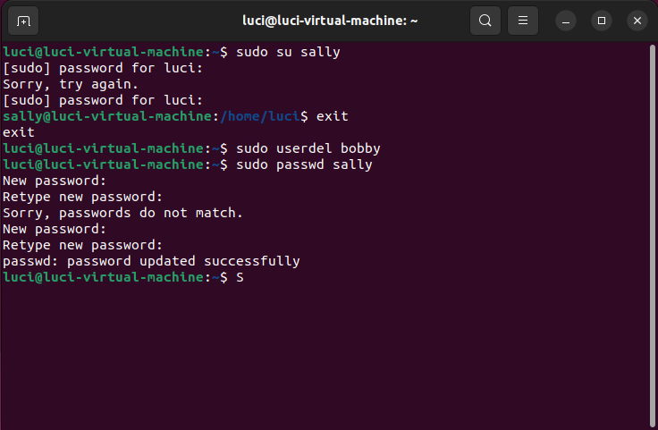
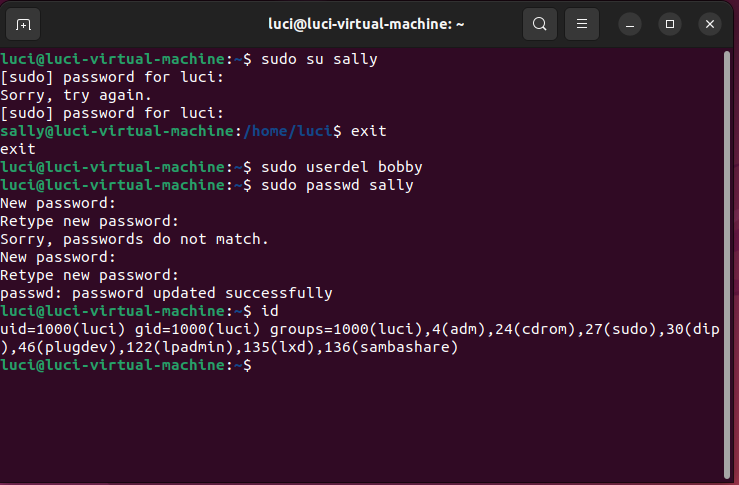
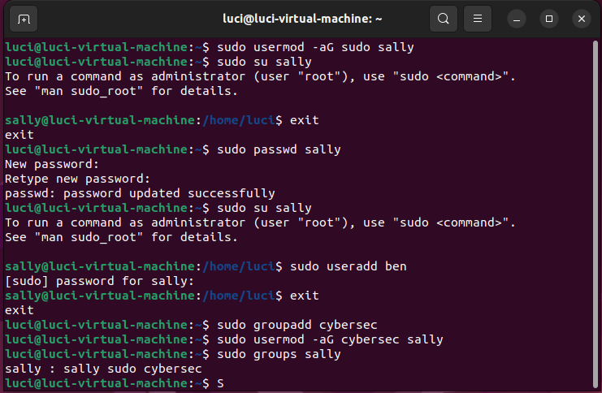
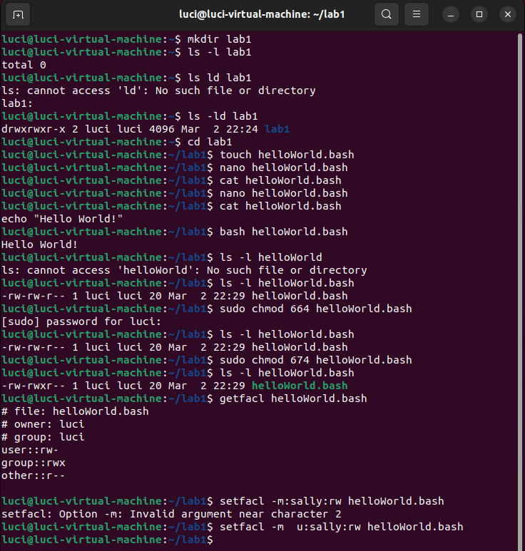

## General System Tasks

### 1.
- sudo apt update
    - make updates available
- apt list --upgradeable
    - list available updates for system

### 2.
- sudo apt upgrade
    - updates the system with available packages and installed packages

### 3.
- sudo reboot
    - reboots the system to refresh system and add the updates

## User Tasks

### 4.

- sudo su root
    - changes current user to root. prompt now shows the new user (root) in front of VM name. it is also no longer green and ends with a hashtag instead of a dollar sign

### 5. & 6.

- sudo useradd bobby
    - doesn't add any home directories, just low-level binary operation
- sudo adduser sally
    - high-level operation, opens perl script that allows you to type personal information in for user, adds default home directory, allows you to change shell, etc.

- sudo su sally 
    - prompt looks like as if i was signed in as myself - it creates an entire new linux user (when i exited and came back, there was an option to sign in as sally)

### 7.

- sudo adduser earl
    - since i did not add a password for sally, i cannot enter in the sudo password for her user, which means the command fails. to allow her to add a new user, i can 
    1.) first add a password 
    2.) grant sudo abilities by adding sally to the sudo group by typing the command `sudo usermod -aG sudo sally`

### 8.

- sudo userdel bobby
    - deleted bobby

### 9.

- sudo passwd sally

### 10.
- if you are staying logged in as root, then anyone who can access your terminal can have root privileges and possibly do malicious activities with full control of your machine

### 11.

- id
    - shows user id

## Group Tasks

### 12.
- ubuntu is debian-based (?)
- the inital groups the main user belongs to include sudo plugdev lpadmin lxd sambdashare adm cdrom and me (luci)

### 13.
- sudo usermod -aG sudo sally
    - add sally to the sudo group so sally can execute sudo commands
- sudo adduser ben
    - add a user as sally

### 14. 
- exit
    - back to luci
- sudo groupadd cybersec
    - create group cybersec

### 15.
- sudo usermod -aG cybersec sally
    - add sally to cybersec group

### 16.
- sudo groups sally, sudo id sally, grep sally /etc/group
    - check to see what groups sally is in

## Permission and Access Control Lists

### 17.
- mkdir lab1
    - create lab1 directory
- ls -ld lab1
    - gets permissions for directory
    - owner and group have read, write, execute while other has only read and execute

### 18.
- cd lab1
    - change directory to lab1
- touch helloWorld.bash
    - create helloWorld bash file
- nano helloWorld.bash
    - open file in nano to write script
    - script to print "Hello World!"
        - echo "Hello World!"
    - make file executable, save and exit
- cat helloWorld.bash
    - print contents of file
- bash helloWorld.bash
    - run file

### 19.
- ls -l helloWorld.bash
    - prints permissions of file
    - permissions are read write for owner and group, while other is only read
- sudo chmod 674 helloWorld.bash
    - change the permissions to includ read and execute on the file for group

### 20.
- getfacl helloWorld.bash
    - prints ACL of file

### 21.
- setfacl -m u:sally:rw helloWorld.bash
    - command to allow user sally to be able to read and write on helloWorld.bash
        - **-m** flag to modify permission
        - **u:sally** defines user
        - **:rw** defines permissions
        - **helloWorld.bash** defines file to be giving permissions for