# Lab 2 — SEED Labs Environment Variable and Set-UID Program Lab

---

## General Setup

- the lab files are downloaded from the SEED website and unpacked from Labsetup.zip

---

## Task 1: Manipulating Environment Variables

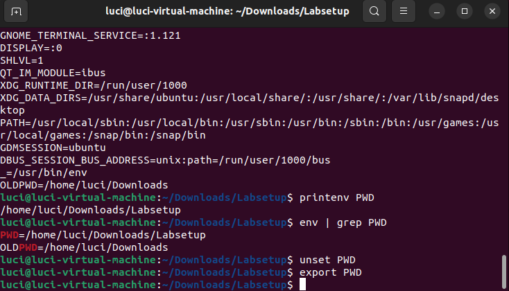

### 1.
- **printenv** / **env**
    - both commands print out all current environment variables in the process
    - to look at a specific variable: **printenv PWD** or **env | grep PWD**

### 2.
- **export ENV_VAR=hello**
    - sets an environment variable and makes it available to child processes
    - export and unset are internal Bash commands, not separate programs — they cannot be found outside of Bash
- **unset ENV_VAR**
    - removes the environment variable entirely
    - running printenv after unset shows the variable is gone

---

## Task 2: Passing Environment Variables from Parent Process to Child Process

### 3. Step 1
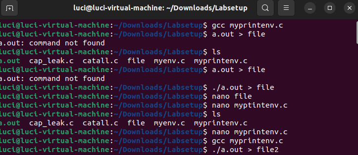
- **gcc myprintenv.c**
    - compiles the program, producing a.out
    - in the initial version, only the child process (case 0) calls printenv()
- **./a.out > file**
    - runs the program and saves the child process's environment to a file

### 4. Step 2
- comment out printenv() in the child case and uncomment it in the parent case (default)
- **gcc myprintenv.c**
    - recompile after modifying the source
- **./a.out > file2**
    - runs the program and saves the parent process's environment to a second file

### 5. Step 3
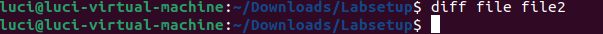
- **diff file file2**
    - compares the two output files
    - no differences are shown, meaning the parent and child have identical environment variables
    - conclusion: fork() creates an exact duplicate of the parent process, including its full environment variable array — the child inherits everything

---

## Task 3: Environment Variables and execve()

### 6. Step 1
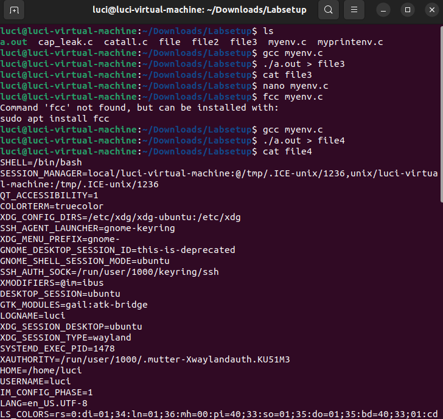
- **gcc myenv.c**
    - compiles myenv.c, which calls execve("/usr/bin/env", argv, NULL)
    - the third argument is NULL, so no environment is passed to the new program
- **./a.out**
    - no environment variables are printed — the new program receives an empty environment

### 7. Step 2
- change the execve() call to: **execve("/usr/bin/env", argv, environ)**
- **gcc myenv.c**
    - recompile with the updated call
- **./a.out**
    - now prints all environment variables — the new program receives the full calling environment

### 8. Step 3
- conclusion: execve() does not automatically inherit the environment — it must be explicitly passed as the third argument
    - NULL = empty environment in the new program
    - environ = full calling environment passed through

---

## Task 4: Environment Variables and system()

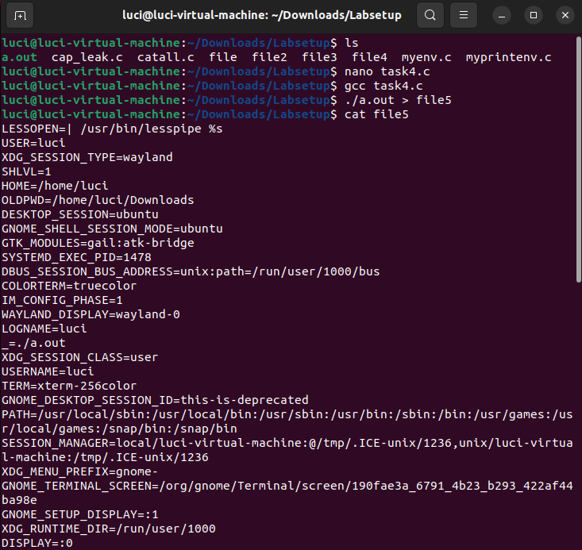

### 9.
- **gcc task4.c**
    - compiles the program which calls system("/usr/bin/env")
- **./a.out**
    - prints all environment variables, identical to printenv
    - system() internally calls execl("/bin/sh", "sh", "-c", command, NULL), which automatically passes the calling process's environ to the shell — the environment is always inherited
    - this is the opposite behavior from execve() with NULL

---

## Task 5: Environment Variables and Set-UID Programs

### 10. Steps 1 & 2
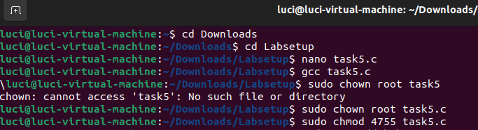
- **gcc task5.c**
    - compiles the program that prints all environment variables
- **sudo chown root a.out**
    - changes ownership of the binary to root
- **sudo chmod 4755 a.out**
    - sets the Set-UID bit — the program now runs with root's privileges regardless of who launches it

### 11. Step 3
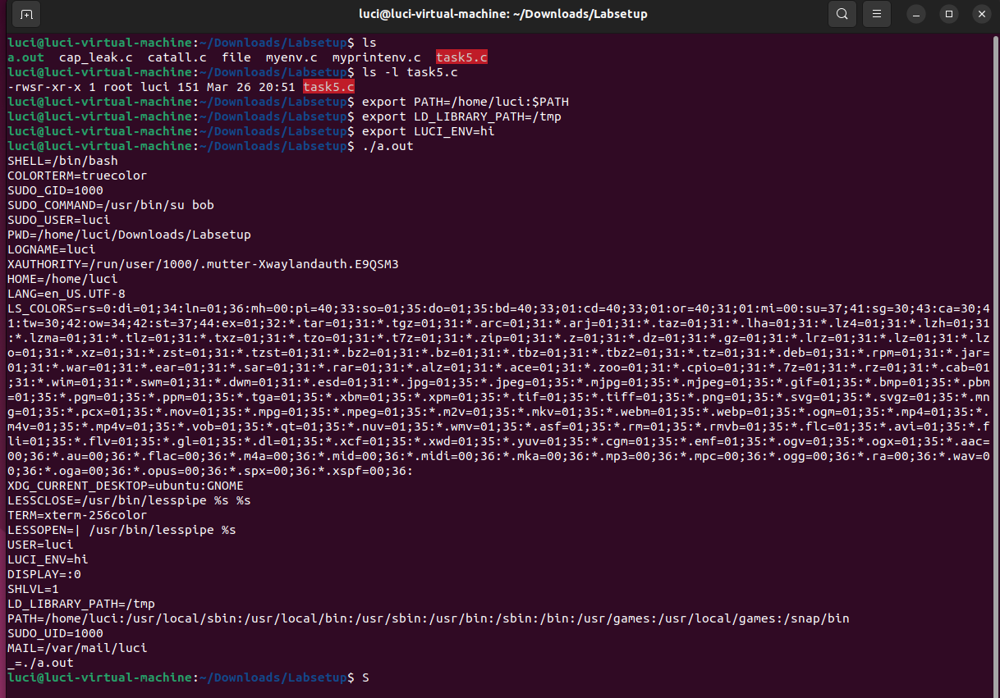
- **export PATH=/home/seed:$PATH**
    - prepends a custom directory to PATH
- **export LD_LIBRARY_PATH=/tmp**
    - sets the library path variable
- **export LUCI_ENV=hi**
    - sets custom variabl
- **./a.out**
    - run the Set-UID program and observe which variables appear
    - PATH and LUCI_ENV are inherited by the Set-UID process
    - LD_LIBRARY_PATH does not appear — the dynamic linker strips it when the real UID differs from the effective UID, as a defense against library injection into privileged programs

---

## Task 6: The PATH Environment Variable and Set-UID Programs

### 12.
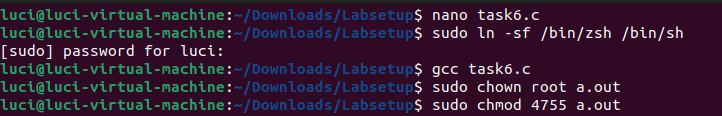
- **sudo ln -sf /bin/zsh /bin/sh**
    - /bin/sh normally points to dash, which drops privileges when it detects a Set-UID context
    - relinking to zsh removes this countermeasure so the attack can be demonstrated
- **gcc task6.c**
    - compiles the vulnerable program that calls system("ls") using a relative path
- **sudo chown root a.out**
- **sudo chmod 4755 a.out**
    - makes it a root-owned Set-UID binary

### 13.
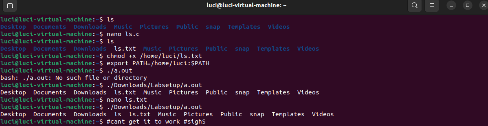
- create a malicious file named ls in /home/luci:
    - contents: #!/bin/sh then /bin/sh on the next line
    - **chmod +x /home/luci/ls** — make it executable
- **export PATH=/home/luci:$PATH**
    - puts the directory containing our fake ls at the front of PATH
- **./a.out**
    - the shell searches PATH in order and finds our fake ls first
    - since zsh does not drop Set-UID privileges, the spawned shell runs as root
    - running **whoami** and **id** inside the new shell confirms root access
- conclusion: Set-UID programs must always use absolute paths for external commands — using a relative path with a user-controlled PATH is a privilege escalation vulnerability
- **sudo ln -sf /bin/dash /bin/sh**
    - restore /bin/sh to dash after the task

---

## Task 7: The LD_PRELOAD Environment Variable and Set-UID Programs

### 14. Step 1 — Build the Library
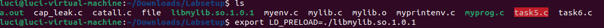
- create mylib.c with a sleep() function that prints "I am not sleeping!" instead of sleeping
- **gcc -fPIC -g -c mylib.c**
    - compile to position-independent object file
- **gcc -shared -o libmylib.so.1.0.1 mylib.o -lc**
    - build the shared library (the -lc argument's second character is a lowercase L)
- **export LD_PRELOAD=./libmylib.so.1.0.1**
    - tell the dynamic linker to load our library before all others
- **gcc myprog.c**
    - compile the test program that calls sleep(1)

### 15. Step 2 — Four Scenarios
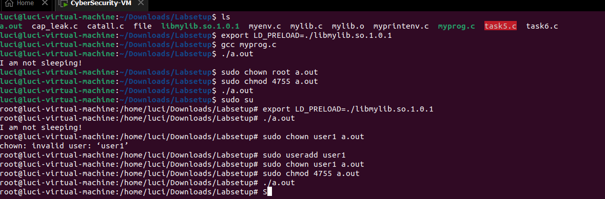
- **./a.out** (regular program, normal user)
    - prints "I am not sleeping!" — LD_PRELOAD is respected for non-privileged programs

- **sudo chown root a.out** then **sudo chmod 4755 a.out** then **./a.out** (Set-UID root, normal user sets LD_PRELOAD)
    - LD_PRELOAD is ignored — real sleep executes and the program pauses for 1 second

- switch to root with **sudo su**, re-export LD_PRELOAD, then **./a.out** (Set-UID root, root sets LD_PRELOAD)
    - prints "I am not sleeping!" again — root's real UID matches effective UID so the linker honors the variable

- **sudo chown user1 a.out** then **sudo chmod 4755 a.out** then **./a.out** (Set-UID user1, run as seed)
    - LD_PRELOAD is ignored again — real sleep executes

### 16. Step 3 — Explanation
- the dynamic linker checks whether real UID == effective UID
    - if they match (no privilege elevation), LD_PRELOAD is honored
    - if they differ (Set-UID elevation is happening), all LD_* variables are silently stripped to prevent library injection into the privileged process
- this explains why scenarios 2 and 4 ignore LD_PRELOAD, while scenarios 1 and 3 respect it

---

## Task 8: Invoking External Programs Using system() vs. execve()

### 17. Step 1 — system()
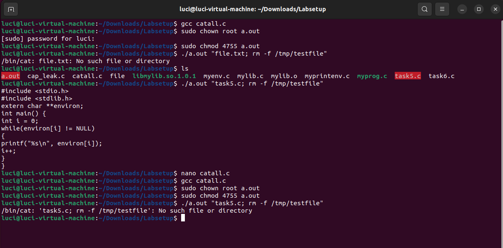
- **gcc catall.c**
    - compile with system(command) active and execve commented out
- **sudo chown root a.out**
- **sudo chmod 4755 a.out**
- **./a.out "file.txt; rm -f /tmp/testfile"**
    - the semicolon is interpreted by the shell spawned by system()
    - the second command executes with root's effective UID
    - the program was intended to be read-only but shell metacharacters allow arbitrary command injection

### 18. Step 2 — execve()
- comment out system(command) and uncomment execve(v[0], v, NULL), then recompile
- **gcc catall.c**
- **sudo chown root a.out** then **sudo chmod 4755 a.out**
- **./a.out "file.txt; rm -f /tmp/testfile"**
    - the attack fails — execve() does not invoke a shell, so the semicolon is passed as a literal part of the filename
    - /bin/cat reports "No such file or directory" and nothing else executes
    - conclusion: privileged programs should use execve() instead of system() when running external commands, especially with any user-supplied input

---

## Task 9: Capability Leaking

### 19.
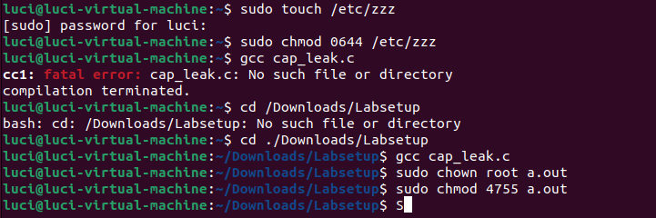
- **sudo touch /etc/zzz**
    - create the protected file
- **sudo chmod 0644 /etc/zzz**
    - root can read and write, everyone else can only read
- **gcc cap_leak.c**
- **sudo chown root a.out**
- **sudo chmod 4755 a.out**
    - make it a root-owned Set-UID binary

### 20.
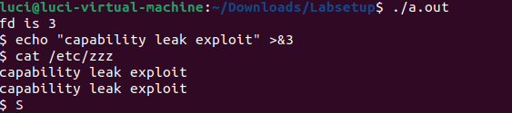
- **./a.out**
    - program opens /etc/zzz for writing while still root, prints the file descriptor number (e.g. fd is 3), then calls setuid(getuid()) to drop privilege, then spawns /bin/sh
    - even though privilege has been dropped, fd 3 is still open with write access because it was opened before setuid() was called
    - the shell inherits all open file descriptors from the process

### 21.
- inside the spawned shell: **echo "capability leak exploit" >&3**
    - writes to /etc/zzz using the inherited file descriptor
- **cat /etc/zzz**
    - confirms the write succeeded — a normal user was able to write to a root-owned file
    - the fix is to call close(fd) before setuid() so the privileged resource is cleaned up before privilege is dropped
